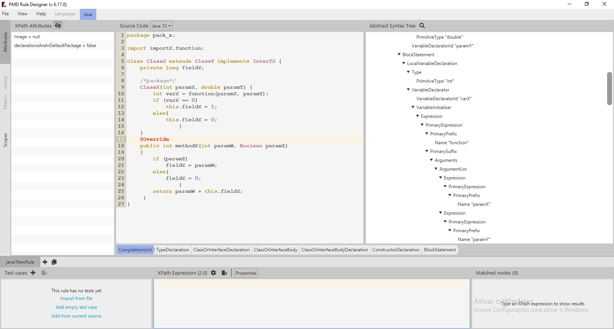

```{r setup, include=FALSE}

library(xml2)
library(tidyverse)
library(gt)
library(knitr)
library(kableExtra)
library(tidygraph)
library(ggraph)
library(patchwork)
library(magrittr)
library(scales)
library(magrittr)
library(kludgenudger)

knitr::opts_chunk$set(echo = FALSE, size = "small", warning = FALSE, message = FALSE, cache = FALSE)

def.chunk.hook  <- knitr::knit_hooks$get("chunk")
knitr::knit_hooks$set(chunk = function(x, options) {
  x <- def.chunk.hook(x, options)
  ifelse(options$size != "normalsize", paste0("\n \\", options$size,"\n\n", x, "\n\n \\normalsize"), x)
})


map_rule_small <- tribble(
    
    ~rule,                              ~small_rule,
    "class_or_interface_body",          "class_body",                   
    "class_or_interface_declaration",   "class_decl",
      "class_or_interface_type",          "class_type",
    "compilation_unit",                 "unit",
    "extends_list",                     "extends",
    "implements_list",                  "implements",
    "import_declaration",               "import",
    "method",                           "method",
    "name",                             "name",
    "package",                          "package",
    "type_declaration",                 "type_decl",
    "constructor_declaration",          "constructor",
    "field_declaration",                "field",
    "variable_id",                      "var_id",
    "formal_parameter",                 "param",
    "formal_parameters",                "params",
    "annotation",                       "annotation",
    "block",                            "block",
    "statement",                        "statement",
    "if_statement",                     "if"

)

 


```


```{r definitions, echo=FALSE}

size_line_of_code <- 160

length_alert_name <- 35

length_alert_name_side_by_side <- 20

size_line_of_code_side_by_side <- 110


pmd_path <- "pmd/bin/pmd.bat"

rule_path <- "rulesets/java/quickstart.xml"

output_path <-  ""  

examples <- tribble(
    
    ~name,                  ~path,                                                              ~output,          
    "Versão Old Original",  "old" ,  "old_original",
    "Versão New 1",         "new",   "new_1"
    
) %>% 
    mutate(id = row_number())

```


\section{Introduction}\label{intro}

This document is part of a larger research project about software degradation caused by careless developers' behavior and strategies to deal with such undesired behavior. 
The strategies to deal with this problem will possibly be inspired by concepts from game theory. 
At this moment, we assume that software degradation can be measured by the number and the types of kludges made by software developers in the code. 
So, one of the goals of this project is to study how software projects evolve in terms of number and kinds of kludges. 
Right now, we are trying to identify kludges by looking at alerts generated by the PMD source code analyzer.

To evaluate how the number of alerts evolves throughout the history of a software project, we must be able to analyze two different versions of a source code module (an old and a new version) and categorize each alert contained in the new version as either **new**, **fixed** or **open**.

A PMD alert generated for the old version is either **open** or **fixed** in the new version. 
An **open** alert remains in the new version of the code. 
A **fixed** alert does not exist in the new version. 

A PMD alert generated for the new version is either **open** or **new**. 
An **open** alert indicates that the same alert was identified in the old version. 
A **new** alert implies that the same alert cannot be identified in the old version. 

The alerts identified as **open** are equivalent in both new and old versions. 
To decide whether an alert is **open**, **fixed** or **new**, one has to identify if an alert in the old version is equivalent to an alert in the new version. 
The intersection between **fixed** alerts, **new** alerts and **open** alerts is empty. 

In order to decide if an alert is **open**, **fixed** or **new**, we have to identify if an alert in the old version is equivalent to an alert in the new version. 
This document describes the algorithms we are using to make this classification.  

In Section \ref{pmd}, I describe how I use PMD source code analyzer in two tasks. 
The first task is to list the alerts that represent possible kludges. 
PMD receives a source code \textcolor{red}{(Prof Márcio, ele pode gerar alertas de um software inteiro, não só um conjunto, por isso tirei "module")} as input and generates a list of bad programming practices contained in the code. 
The process we follow to generate the alerts using PMD source code analyzer is discussed in Section \ref{pmd_alerts}. 
The other task for which we use PMD is in the creation of an Abstract Syntax Tree (AST) from a source code with selected nodes. 
This will help us in one of the algorithms described in Section \ref{alg}. 
The creation of the AST using PMD is described in Section \ref{ast}.

In Section \ref{alg}, I describe two algorithms that categorize the alerts as **new**, **fixed** or **open**. 
The first one, described in Section \ref{alg1}, is a naive algorithm based on matches by lines of code and some key features of the alerts. 
The second is a more sophisticated algorithm, based on matches by blocks of code, using the Abstract Syntax Tree.


\section{PMD Source Code Analyzer}\label{pmd}

PMD is static source code analyzer that is commonly used to find possible programming flaws. 
In this work we use PMD for two tasks: to generate alerts that we interpret as clues about kludges and to create an AST from the source code with selected kinds of node.

\subsection{Using PMD to generate alerts}\label{pmd_alerts}

PMD traverses the AST of a source code searching for violations of rules which are configured by the user. 
PMD comes with a default rule set for Java language. 
The default rule set finds common programming flaws like unused variables, empty catch blocks, unnecessary object creation, and so forth. 
It´s possible to configure a different set of rules creating a custom XML file. 
At this point we use the default rule set to generate the alerts that we interpret as kludges and try to categorize by the algorithms described in Section \ref{alg}

\newpage
   
In Figure \ref{simple_code}, we can see an example of a simple code and the alerts that were generated by the default rule set of PMD alerts tool.


```{r}

saida_alg2 <- kludgenudger::calculate_features_from_versions(
  code_file_old = "little-tree/code.java",
  code_file_new = "little-tree-new/code.java",
  pmd_path = "pmd/bin/pmd.bat"
)


```


```{java code old simple, code=read_and_decorate_code_and_alerts("little-tree/code.java",   saida_alg2$versions_executed$pmd_output[[1]], FALSE, 10), echo = TRUE }

```


\subsection{Using PMD to generate an Abstract Syntax Tree }\label{ast}

The AST is used, in conjunction with the relation between the lines we will see in Section \ref{map}, to understand the location of an alert in a version of a code. 
We use this information in the algorithm described in Section \ref{alg2}

PMD lets us configure our own rules. Figure \ref{pmd_designer_fig} shows the designer tool that helps a user to create custom rules.



We can see that the tool traverses the source code visiting many different kinds of elements. 
If we build our own simple rules, aimed only to capture some kinds of elements, we will generate list of "alerts" that will contain all the elements of the chosen kinds contained in the AST.

\newpage

In Figure \ref{ruleset}, we show an example of a rule set that captures all the method declarations.

```{xml, code=read_lines("data/blockrules/extractblockrules.xml"), echo = TRUE }

```


Table \ref{selected_nodes} shows the kinds of elements that were selected for the creation of an AST for the code in Figure \ref{simple_code}.


```{r}


map_rule_small %>%
  arrange(
    rule
  ) %>% 
  mutate(
    rule_number = row_number()
  ) %>%
  select(rule_number, rule) %>%
  kable(
    format = "latex",
    caption = "Kinds of elements selected\\label{selected_nodes}",
    escape = TRUE
  ) %>%
  kable_styling(
    font_size = 8,
    latex_options = c("hold_position", "striped")
  )
  


```


When we select the list in Table \ref{selected_nodes}, the simple code shown in Figure \ref{simple_code} captures the elements shown in Table \ref{elements_captured}    


```{r}

nodes <- kludgenudger::read_raw_ast_nodes(
  code_location = "little-tree/code.java",
  output_location <-  "little-tree/code.xml",
  pmd_location = "C:/doutorado/AnaliseTwitter4j/pmd/bin",
  blockrules_location = "data/blockrules/blockrules.xml"
  
)

kludgenudger::show_latex_raw_ast_nodes(nodes)


```


Table \ref{selected_nodes} contains the list and location of the elements of the AST. 
In order to recreate the AST, we must follow three steps:

1. Link each element $a$ to the set of elements $X$ that are fully contained between the begin line / begin column and end line / end column of element $a$. 
We can construct a directed graph in which the elements are the nodes and the links described are the edges. 
This is not a tree yet, because each node will have edges directed to all its descendants and not only its children in the AST.

2. Sort the nodes in the decreasing order of its number of children. 
The objective is to establish that, in a search through this graph, the first child chosen will be the one that is a child in the AST, and not only a descendant.

3. Proceed a deep-first search starting from the compilation unit node.

\newpage

After we follow these steps, we come up with the AST as we see in Figure \ref{AST}.


```{r, echo=FALSE, message=FALSE, warning=FALSE,  out.width="100%", fig.width=12, fig.height=16, fig.cap="Abstract Syntax Tree \\label{AST}" }

graph_dfs_tree <- kludgenudger::generate_ast_tree_from_raw_nodes(nodes)

show_ast(graph_dfs_tree)

nodes_ast <- graph_dfs_tree %>% as_tibble()


```

\newpage


\section{Algorithms to categorize alerts}\label{alg}


\subsection{Matches using the Abstract Syntax Tree and the relation between lines of code of the versions}\label{alg2}

In this algorithm we use the AST to create features that help to infer if the alerts in different versions must be considered the same.

In the Section \ref{feature_creation}, we show how the features are created.

Even though it's not possible to be sure if a pair alerts in different versions are same alert, we think that these features can provide some clues.

The features can be an input to a heuristic or a machine learning tool which can decide if the alerts are the same.


\subsubsection{Feature engineering} \label{feature_creation}

In this Section, we will consider the old version in Figure \ref{old_simple_code} and the new version in Figure \ref{new_simple_code}

\newpage

```{java code old version, code=kludgenudger::read_and_decorate_code_and_alerts("little-tree/code.java", saida_alg2$versions_executed$pmd_output[[1]], FALSE, 10), echo = TRUE }

```


\newpage

```{java code new version, code=kludgenudger::read_and_decorate_code_and_alerts("little-tree-new/code.java", saida_alg2$versions_executed$pmd_output[[2]], FALSE, 10), echo = TRUE }

```


In Figure \ref{AST_compare} we can see both ASTs, from the old and the new version. In this figure, the number of the nodes are meaningless. We can see the alerts linked to its nodes.


```{r, echo=FALSE, message=FALSE, warning=FALSE,  out.width="100%", fig.width=20, fig.height=20, fig.cap="Abstract Syntax Trees. New and old versions \\label{AST_compare_id_alerts}", fig.pos="H"}

chart_graph_new <- kludgenudger::show_ast(
  saida_alg2$graph_new_with_alert,
  size_label = 5,
  show_label = TRUE,
  alpha_label = 1,
  name_field = "text_alert_id_node"

)

chart_graph_old <- kludgenudger::show_ast(
  saida_alg2$graph_old_with_alert,
  size_label = 5,
  show_label = TRUE,
  alpha_label = 1,
  name_field = "text_alert_id_node"

)


chart_graph_old + chart_graph_new


```


```{r , echo=FALSE, message=FALSE, warning=FALSE,  out.width="100%", fig.width=12, fig.height=8, fig.cap="Abstract Syntax Trees compared. New and old versions \\label{AST_compare}", fig.pos="H"}


chart_graph_old <- kludgenudger::show_ast(
  saida_alg2$graph_old_with_group, 
  size_label = 4, 
  show_label = TRUE, 
  alpha_label = "mostra", 
  title = "Old version"
) 

chart_graph_new <- kludgenudger::show_ast(
  saida_alg2$graph_new_with_group, 
  size_label = 4, 
  show_label = TRUE, 
  alpha_label = "mostra",
  title = "New version"
)
  

chart_graph_old + chart_graph_new


```


In Figure \ref{AST_groups} the nodes with the same numbers defined as equivalent. We define that a node from an AST is equivalent to a node of the AST of the subsequent version if:
   
- Considering the relation between the lines of the two versions constructed as we saw in Section \ref{map}, the nodes in both trees begin and end in related lines

- The nodes are of the same kind


```{r , echo=FALSE, message=FALSE, warning=FALSE,  out.width="100%", fig.width=12, fig.height=8, fig.cap="Abstract Syntax Tree \\label{AST_groups}", fig.pos="H"}

chart_graph_old <- kludgenudger::show_ast(
  saida_alg2$graph_old_with_group, 
  size_label = 4, 
  show_label = TRUE, 
  alpha_label = 0, 
  node_text_field = "id_group" 
)

chart_graph_new <- kludgenudger::show_ast(
  saida_alg2$graph_new_with_group, 
  size_label = 4, 
  show_label = TRUE, 
  alpha_label = 0, 
  node_text_field = "id_group" 
)


chart_graph_old + chart_graph_new


```


In Figure \ref{AST_with_alerts} we add the alerts that are related with nodes in the AST.


```{r , echo=FALSE, message=FALSE, warning=FALSE,  out.width="100%", fig.width=20, fig.height=20, fig.cap="Abstract Syntax Tree \\label{AST_with_alerts}", fig.pos="H"}


chart_graph_old <- kludgenudger::show_ast(
  saida_alg2$graph_old_with_alert, 
  size_label = 5, 
  show_label = TRUE, 
  alpha_label = 1, 
  node_text_field = "id_group",
  name_field = "text_alert"
  
)


chart_graph_new <- kludgenudger::show_ast(
  saida_alg2$graph_new_with_alert, 
  size_label = 5, 
  show_label = TRUE, 
  alpha_label = 1, 
  node_text_field = "id_group",
  name_field = "text_alert"
  
)


chart_graph_old + chart_graph_new


```

The path between the alert and the root of the AST can be seen in \ref{AST_alert_1}


```{r, echo=FALSE, message=FALSE, warning=FALSE,  out.width="100%", fig.width=12, fig.height=6, fig.cap="Abstract Syntax Tree \\label{AST_alert_1}", fig.pos="H"}

kludgenudger::show_ast(
  saida_alg2$graphs_from_alerts_old %>%  rename( id_alert = id_alert_old, graph = graph_old) %$% graph[[1]] , 
  size_label = 4
)


 


```

The algorithm generates a set of features for each pair of alerts $(n,o)$ with one element $n$ coming from the old version and one element $o$ coming from the new version.

We propose the following list of features:

* Same Rule: a boolean indicator that tells if the alerts are of the sdame type

* Same Group ID: a boolean indicator that tells if the alerts are equivalent as defined in Figure \ref{AST_groups}

* Same Method Group ID: a boolean indicator that tells if the alerts belong to the same method. We know the alert's method following the path from the alert´s node to the root. The first node of the kind "method" found in this path defines the alert's method. If this is the same for $o$ and for $n$, then they belong to the same method.

* Same Method Name: a boolean indicator that tells if the alerts were found in a method with the same name.

* Same Block: a boolean indicator that shows if the $o$ and $n$ belong to the same block. It is defined the same way the "Same method" indicator is defined.

* Same Code: a boolean indicator that shows the nodes that generate the alert have the same programming code.

* Line distance: $o$ and $n$ have a begin line $b(o)$ and $b(n)$ and an end line $e(n)$ and $e(n)$. Line distance is $abs(mean(b(o), e(o)) - mean(b(n), e(n)))$

* Normalized line distance (block size): this is the line distance but normalized by the size of the last common node.

* Normalized line distance (method size): this is the line distance but normalized by the size of the last common method (if there is no common method, it´s normalized by the side of the compilation unit).

* Normalized line distance (compilation unit size): this is the line distance but normalized by the size of the compilation unit.

Table \ref{table_features} shows the combinations $(n,o)$ in the example. There are $2 \cdot 1 = 2$ combinations whereas we have two alerts in the old version and one alert in the new one.  


```{r}

kludgenudger::report_features(saida_alg2, "Resulting features\\label{table_features} ")
  
```


```{r}

features_rename <- kludgenudger::calculate_features_from_versions(
  code_file_new = "data/rename_method/new/code.java" ,
  code_file_old = "data/rename_method/old/code.java",
  pmd_path = "pmd/bin/pmd.bat"

)

```


\subsubsection{Example: Renaming method} \label{example_rename_method}

In this example, the new and old versions have only one alert. The method in which the alert happens is renamed from MethodX to methodZ.

\newpage

```{java rename old version, code=kludgenudger::read_and_decorate_code_and_alerts("data/rename_method/old/code.java", features_rename$versions_executed$pmd_output[[1]], FALSE, 10), echo = TRUE }

```


\newpage

```{java rename new version, code=kludgenudger::read_and_decorate_code_and_alerts("data/rename_method/new/code.java", features_rename$versions_executed$pmd_output[[2]], FALSE, 10), echo = TRUE }

```


In the Table \ref{features_rename} we can see that the features "Same Method Name" and "Same Method Group ID" are now FALSE.

```{r}

kludgenudger::report_features(features_rename, "Resulting features: rename method example \\label{features_rename} ")


```


\subsubsection{Example: including a statement before} \label{example_including_statement}


```{r}

include_statement_before <- kludgenudger::calculate_features_from_versions(
  code_file_new = "data/include_statement_before/new/code.java" ,
  code_file_old = "data/include_statement_before/old/code.java",
  pmd_path = "pmd/bin/pmd.bat"

)

```


In this example, a new statement is included before the alert.

\newpage

```{java include_statement_before old version, code=kludgenudger::read_and_decorate_code_and_alerts("data/include_statement_before/old/code.java", include_statement_before$versions_executed$pmd_output[[1]], FALSE, 10), echo = TRUE }

```


\newpage

```{java include_statement_before new version, code=kludgenudger::read_and_decorate_code_and_alerts("data/include_statement_before/new/code.java", include_statement_before$versions_executed$pmd_output[[2]], FALSE, 10), echo = TRUE }

```


In the Table \ref{include_statement_before} we can see that the features are not affected by this new statement.

```{r}

kludgenudger::report_features(include_statement_before, "Resulting features: statement included before \\label{include_statement_before} ")


```


\subsubsection{Example: nesting the alert in an if statement} \label{example_nested_in_other_if}

```{r}

nested_in_other_if <- kludgenudger::calculate_features_from_versions(
  code_file_new = "data/nested_in_other_if/new/code.java" ,
  code_file_old = "data/nested_in_other_if/old/code.java",
    pmd_path = "pmd/bin/pmd.bat"

)

```


In this example, the statement that generates the alert is nested in an if statement that did not exist.

\newpage

```{java nested_in_other_if old version, code=kludgenudger::read_and_decorate_code_and_alerts("data/nested_in_other_if/old/code.java", nested_in_other_if$versions_executed$pmd_output[[1]], FALSE, 10), echo = TRUE }

```


\newpage

```{java nested_in_other_if new version, code=kludgenudger::read_and_decorate_code_and_alerts("data/nested_in_other_if/new/code.java", nested_in_other_if$versions_executed$pmd_output[[2]], FALSE, 10), echo = TRUE }

```


In the Table \ref{nested_in_other_if} we can see that the algorithm does not recognize the two nodes as equivalent, but other features can lead us to the conclusion that the alert is still open.

```{r}

kludgenudger::report_features(nested_in_other_if, "Resulting features: statement included before \\label{nested_in_other_if} ")


```


\subsubsection{Example: editing the line that generates the alert} \label{example_editing_line}

```{r}

editing_line <- kludgenudger::calculate_features_from_versions(
  code_file_new = "data/editing_line/new/code.java" ,
  code_file_old = "data/editing_line/old/code.java",
    pmd_path = "pmd/bin/pmd.bat"

)

```


\newpage

```{java editing_line old version, code=kludgenudger::read_and_decorate_code_and_alerts("data/editing_line/old/code.java", editing_line$versions_executed$pmd_output[[1]], FALSE, 10), echo = TRUE }

```


\newpage

```{java editing_line new version, code=kludgenudger::read_and_decorate_code_and_alerts("data/editing_line/new/code.java", editing_line$versions_executed$pmd_output[[2]], FALSE, 10), echo = TRUE }

```


In the Table \ref{editing_line} the nodes are not recognized as equivalent, but other features can lead us to the conclusion that the alert is still open.

```{r}

kludgenudger::report_features(editing_line, "Resulting features: statement included before \\label{editing_line} ")


```


\subsubsection{Example: changing the order of the methods} \label{example_editing_line}


We changed the order of the methods in two ways


```{r}

changing_method_order <- kludgenudger::calculate_features_from_versions(
  code_file_new = "data/changing_method_order/new/code.java" ,
  code_file_old = "data/changing_method_order/old/code.java",
    pmd_path = "pmd/bin/pmd.bat"

)

```


\newpage

```{java changing_method_order old version, code=kludgenudger::read_and_decorate_code_and_alerts("data/changing_method_order/old/code.java", changing_method_order$versions_executed$pmd_output[[1]], FALSE, 10), echo = TRUE }

```


\newpage

```{java changing_method_order new version, code=kludgenudger::read_and_decorate_code_and_alerts("data/changing_method_order/new/code.java", changing_method_order$versions_executed$pmd_output[[2]], FALSE, 10), echo = TRUE }

```


In the Table \ref{changing_method_order} the nodes are not recognized as equivalent, but other features can lead us to the conclusion that the alert is still open.

```{r}

kludgenudger::report_features(changing_method_order, "Resulting features: statement included before \\label{changing_method_order} ")


```


```{r}

changing_method_order_2 <- kludgenudger::calculate_features_from_versions(
  code_file_new = "data/changing_method_order_2/new/code.java" ,
  code_file_old = "data/changing_method_order_2/old/code.java",
    pmd_path = "pmd/bin/pmd.bat"

)

```


\newpage

```{java changing_method_order_2 old version, code=kludgenudger::read_and_decorate_code_and_alerts("data/changing_method_order_2/old/code.java", changing_method_order_2$versions_executed$pmd_output[[1]], FALSE, 10), echo = TRUE }

```


\newpage

```{java changing_method_order_2 new version, code=read_and_decorate_code_and_alerts("data/changing_method_order_2/new/code.java", changing_method_order_2$versions_executed$pmd_output[[2]], FALSE, 10), echo = TRUE }

```


In the Table \ref{changing_method_order_2} the nodes are not recognized as equivalent, but other features can lead us to the conclusion that the alert is still open.

```{r}

kludgenudger::report_features(changing_method_order, "Resulting features: statement included before \\label{changing_method_order_2} ")


```


